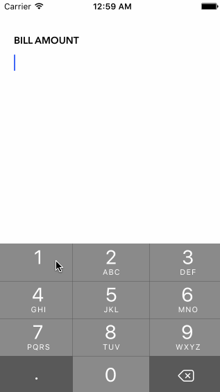

# Pre-work - *TipTip*

**TipTip** is a tip calculator application for iOS.

Submitted by: **Patrick Wong**

Time spent: **4** hours spent in total

## User Stories

The following **required** functionality is complete:
* [x] User can enter a bill amount, choose a tip percentage, and see the tip and total values.

The following **optional** features are implemented:
* [x] Custom font
* [x] UI animations - Alpha fade
* [x] Making sure the keyboard is always visible and the bill amount is always the first responder. This way the user doesn't have to tap anywhere to use this app. Just launch the app and start typing.

The following **additional** features are implemented:

* [x] Auto Layout
* [x] Shake gesture to clear text fields
* [x] Dark keyboard
* [x] Clear textfield

## Video Walkthrough

Here's a walkthrough of implemented user stories:

GIF created with [LiceCap](http://www.cockos.com/licecap/).

## Notes

Challenges encountered:
Still learning Auto Layout quirks. Took awhile to figure out that I needed to uncheck "constrain to margins" in Auto Layout to layout exactly to the screen.

## License

    Copyright [2016] [Patrick Wong]

    Licensed under the Apache License, Version 2.0 (the "License");
    you may not use this file except in compliance with the License.
    You may obtain a copy of the License at

        http://www.apache.org/licenses/LICENSE-2.0

    Unless required by applicable law or agreed to in writing, software
    distributed under the License is distributed on an "AS IS" BASIS,
    WITHOUT WARRANTIES OR CONDITIONS OF ANY KIND, either express or implied.
    See the License for the specific language governing permissions and
    limitations under the License.
